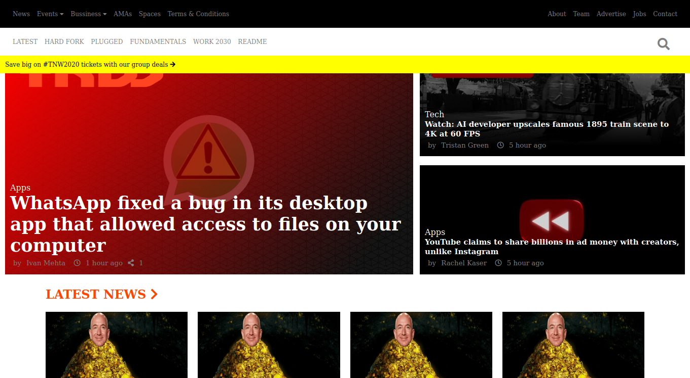

> Responsive Design - building websites adaptable to different screen sizes

- A fully responsive clone of [The Next Web homepage](https://thenextweb.com)

## Built With

- HTML5 and CSS3
- VSCode, Linters, Stylelint, Validator.w3

## Live Demo

[Demo Link](https://boring-euclid-37ebf1.netlify.com/)

## Getting Started

- Clone the repo to your machine
- Open with chosen text editor
- Experiment with editing the HTML and CSS files

### Prerequisites

- Get your browsers up to date

### Install

- Install VSCode or any code editor you like
- Install Node JS and nmp(most recents versions)
- Run this command on your terminal in order to install stylelint `npm install stylelint stylelint-config-recommended --save-dev`

### Run tests

- Test the css by running `npx stylelint .`
- Go to http://validator.w3.org/ , upload the index.html file to test it.

### Deployment

- Choose an online web hosting service
- Upload all the files in the htdocs folder of your domain
- Access your domain name in browser

## Authors

👤 **Author1**
Stefan Dili

- Github: [@githubhandle](https://github.com/dili021)
- Twitter: [@twitterhandle](@dilistefan)
- Linkedin: [linkedin](stefan-dili)

👤 **Author2**
Aremu Lucky

- Github: [@githubhandle](https://github.com/Luckyaremu)
- Twitter: [@twitterhandle](@luckyaremu)
- Linkedin: [linkedin]()

## 🤝 Contributing

- Contributions, issues and feature requests are welcome!

## Show your support

Give a ⭐️ if you like this project!
